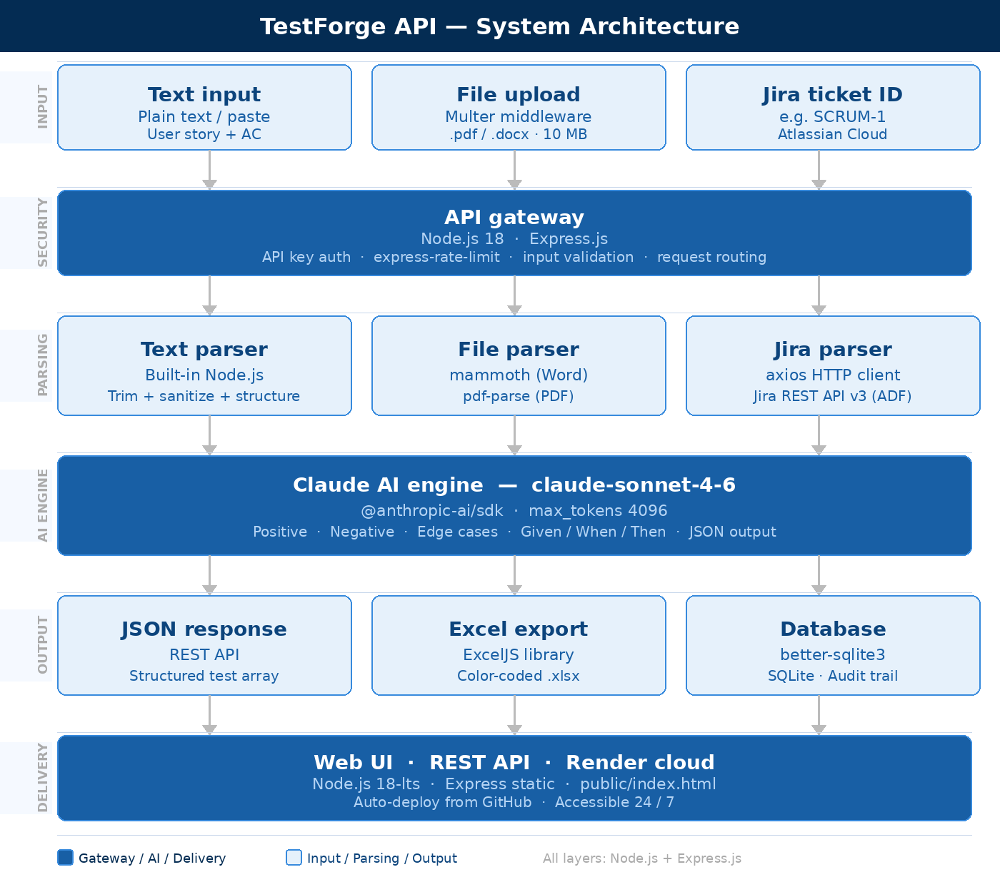

# TestForge API 🧪

> AI-powered test case generator built with Node.js and Claude AI

An intelligent REST API that automatically generates comprehensive test cases from user stories — covering positive, negative, and edge case scenarios in Given/When/Then format. Built by a Senior Business Systems Analyst to demonstrate real-world AI automation in a fintech context.

---

## 🎯 What It Does

Instead of spending 2-3 hours manually writing test cases, TestForge does it in seconds:

1. Give it a **user story** — via text, Word/PDF document, or Jira ticket ID
2. Claude AI **reads and understands** the requirements
3. Get back **comprehensive test cases** instantly
4. **Download as Excel** and send to your QA team

---

## ✨ Features

| Feature | Description |
|---|---|
| 📝 Text input | Paste any user story and acceptance criteria |
| 📄 File upload | Upload Word (.docx) or PDF documents |
| 🎫 Jira integration | Type a ticket ID — auto-fetches from Jira |
| 🤖 Claude AI engine | Generates positive, negative and edge cases |
| 📊 Excel export | Download test cases as color-coded .xlsx |
| 🌐 Web UI | Browser-based interface — no coding needed |
| 🔐 API key security | Protected endpoints with rate limiting |
| ✅ Input validation | Clean error handling on all endpoints |

---

## 🏗️ Tech Stack

| Technology | Purpose |
|---|---|
| Node.js + Express | REST API server |
| Anthropic Claude API | AI test case generation |
| ExcelJS | Excel file generation |
| Mammoth | Word document parsing |
| pdf-parse | PDF text extraction |
| Multer | File upload handling |
| Axios | Jira REST API calls |
| dotenv | Secure credential management |
| express-rate-limit | API rate limiting |

---

## 🚀 Getting Started

### Prerequisites
- Node.js v18+
- Anthropic API key from [console.anthropic.com](https://console.anthropic.com)

### Installation

```bash
git clone https://github.com/judelivingsten/testforge-api.git
cd testforge-api
npm install
```

### Environment Variables

Create a `.env` file:

```bash
ANTHROPIC_API_KEY=your-claude-api-key
APP_API_KEY=your-chosen-api-key
PORT=3000

# Optional — for Jira integration
JIRA_DOMAIN=https://yourcompany.atlassian.net
JIRA_EMAIL=your-email@company.com
JIRA_API_TOKEN=your-jira-api-token
```

### Run the Server

```bash
node src/index.js
```

Open your browser at `http://localhost:3000` ✅

---

## 📡 API Endpoints

### Generate from Text
```bash
POST /api/v1/generate
x-api-key: your-api-key
Content-Type: application/json

{
  "userStory": "As a bank customer I want to login",
  "acceptanceCriteria": "User enters valid email and password."
}
```

### Generate from File Upload
```bash
POST /api/v1/generate/file
x-api-key: your-api-key
Content-Type: multipart/form-data

document: [your PDF or Word file]
```

### Fetch Jira Ticket Details
```bash
GET /api/v1/jira/SCRUM-1
x-api-key: your-api-key
```

### Generate from Jira Ticket
```bash
GET /api/v1/generate/jira/SCRUM-1
x-api-key: your-api-key
```

### Export as Excel
```bash
POST /api/v1/export/excel
x-api-key: your-api-key
Content-Type: application/json

{
  "testCases": [...]
}
```

---

## 📋 Sample Response

```json
{
  "testCases": [
    {
      "id": "TC-001",
      "title": "Successful login with valid credentials",
      "type": "positive",
      "priority": "high",
      "given": "User is on the login page",
      "when": "User enters valid email and password",
      "then": "User is redirected to the dashboard"
    },
    {
      "id": "TC-002",
      "title": "Login fails with wrong password",
      "type": "negative",
      "priority": "high",
      "given": "User is on the login page",
      "when": "User enters wrong password",
      "then": "Error message is displayed"
    },
    {
      "id": "TC-003",
      "title": "Account locks after 3 failed attempts",
      "type": "edge",
      "priority": "high",
      "given": "User has failed login twice",
      "when": "User fails login a third time",
      "then": "Account is locked and user is notified"
    }
  ]
}
```

---

## 🌐 Web UI

Open `http://localhost:3000` in your browser:

- **Jira Integration** — type a ticket ID and auto-fill the form
- **Text Input** — paste user stories directly
- **File Upload** — drag and drop Word or PDF files
- **Color-coded results** — green (positive), red (negative), orange (edge)
- **One-click Excel download**

---

## 🏦 Real World Use Cases

- **Banking** — generate test cases for digital banking features
- **Mortgage Tech** — automate test coverage for loan workflows
- **Insurance** — cover complex claims processing rules
- **SaaS** — integrate with Jira for zero-touch test generation
- **Any Agile team** — accelerate sprint delivery with AI-assisted QA

---

## 🔒 Security

- All `/api` routes require an `x-api-key` header
- Rate limiting: 100 requests per hour per key
- Credentials stored in `.env` — never committed to GitHub
- Jira credentials stored server-side only

---

## 📁 Project Structure
testforge-api/
├── src/
│   ├── index.js
│   ├── routes/
│   │   ├── generate.js
│   │   └── export.js
│   ├── parsers/
│   │   ├── fileParser.js
│   │   └── jiraParser.js
│   ├── prompts/
│   │   └── testCaseGenerator.js
│   ├── formatters/
│   │   └── excelFormatter.js
│   └── middleware/
│       └── auth.js
├── public/
│   └── index.html
├── .env
├── .gitignore
└── README.md

---

## 🏗️ System Architecture



## 🗺️ Roadmap

- [x] Core API with Claude AI integration
- [x] Excel export
- [x] PDF and Word file upload
- [x] Web UI
- [x] Jira integration
- [x] Jira ticket input in Web UI
- [ ] Database storage
- [ ] Cloud deployment
- [ ] Webhook support

---

## 👤 About

Built by **Jude Livingsten** — Senior Business Systems Analyst  
8+ years experience in banking, fintech, and SaaS  
CCBA Certified | B.S. Computer Science  
📍 Brantford, Ontario, Canada  
🔗 [github.com/judelivingsten](https://github.com/judelivingsten)

---

*Built with Claude AI by Anthropic | April 2026*